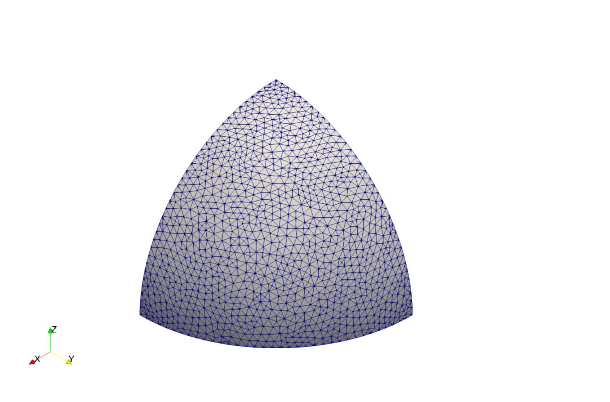

# A SPEEDUP COMPARISON BETWEEN PARALLEL IMPLEMENTATIONS OF GEOMECHANICAL COUPLING SCHEMES

---

## Abstract

In the present work, a speedup comparison between two poroelasticity coupling schemes is performed. In the *Fully Implicit Method* (FSS), the geomechanics-flow coupling is implicitly accomplished in the solution of the linear system, since the mechanical balance and mass conservation equations are solved in a single linear system. In turn, the *Fixed-Stress Split* (FSS) consists of segregately solving these equations, and the coupling is achieved through an iterative procedure at each time step. Both methods have been parallelized by the *Domain Decomposition Method*, in which the computational domain is divided into subdomains, which are then assigned to a processor. Once that all processors work simultaneously, the time required to evaluate the unknowns throughout the domain is equivalent to the time taken by a processor to elicit the unknowns concerning its subdomain in addition to the inter-processor communication time. The performance test is carried out through the solution of two poroelasticity problems: Terzaghi's column and Cryer's sphere. Although the Fixed-Stress Split has shown a larger speedup, it is still outperformed by the Fully Implicit Method in all simulated scenarios.

---

## Resumo

Neste trabalho é feita uma comparação do desempenho em paralelo entre dois métodos de acoplamento para poroelasticidade. No *Fully Implicit Method*, o acoplamento escoamento-geomecânica é implicitamente realizado na solução do sistema linear, uma vez que as equações de balanço mecânico e de conservação da massa são resolvidas num único sistema. No que lhe concerne, o *Fixed-Stress Split* consiste em resolver estas duas equações separadamente, e o acoplamento se dá através de um processo iterativo que é repetido a cada passo no tempo. Ambos os métodos foram paralelizados através do *Método de Decomposição do Domínio*, onde o domínio de cálculo é dividido em subdomínios, e cada um destes é atribuído a um processador. Como os processadores trabalham simultaneamente, o tempo necessário para determinar as incógnitas em todo o domínio equivale ao tempo gasto por um processador para definir as incógnitas no seu subdomínio somado com o tempo de comunicação entre processadores. O teste de desempenho é realizado através da solução de dois problemas de poroelasticidade: a coluna de Terzaghi e a esfera de Cryer. Embora o Fixed-Stress Split tenha apresentado o maior aumento de desempenho em decorrência da paralelização ele gastou mais tempo de CPU que o Fully Implicit Method em todas as simulações realizadas.

---

## Conclusions

- FSS has shown a larger speedup, however, it is outperformed by the FIM.

---

## A Few Figures

### Subdomain Composition

    
    
    

### Subdomains

    
    

    
    

### Cryer's Sphere Speedup Comparison

    

